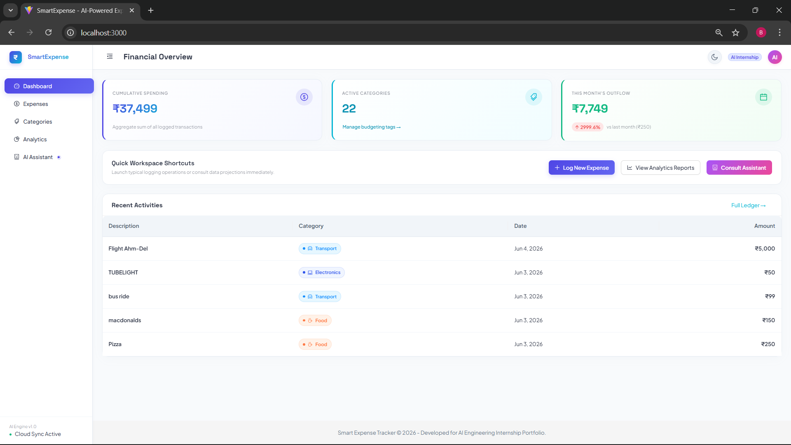
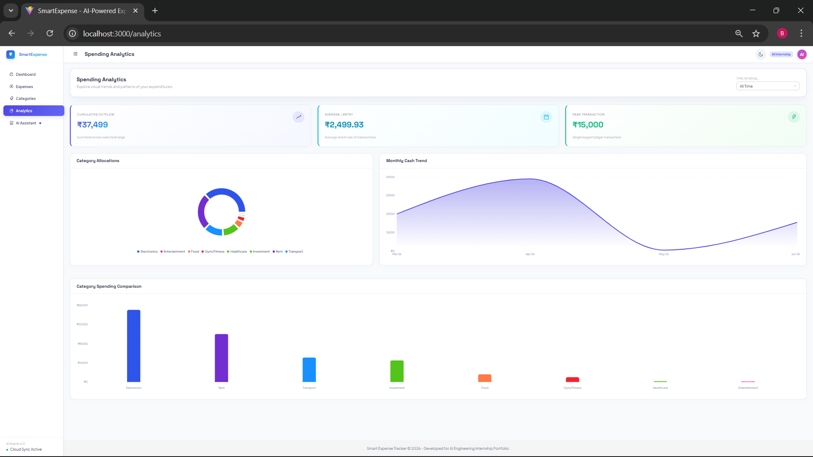
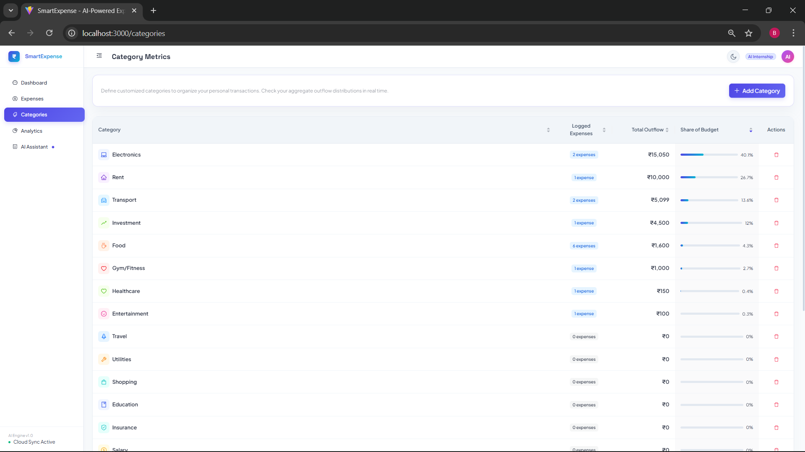
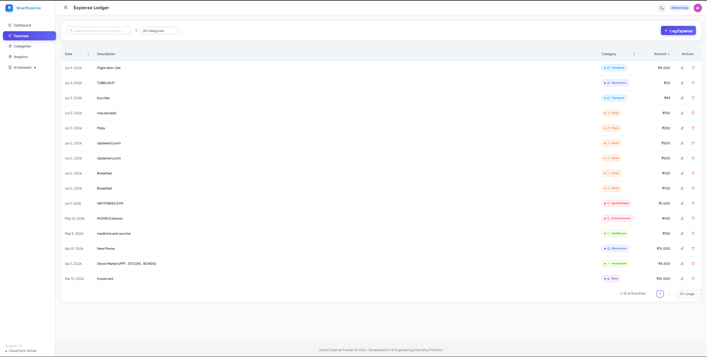
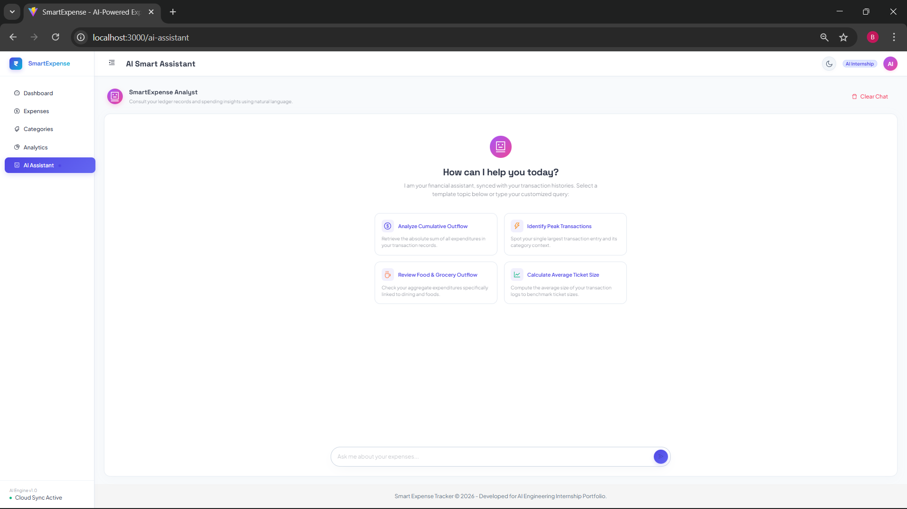
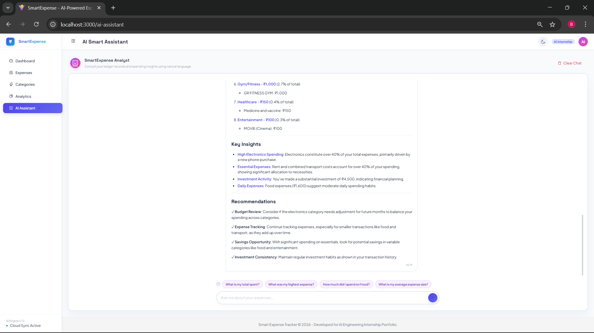
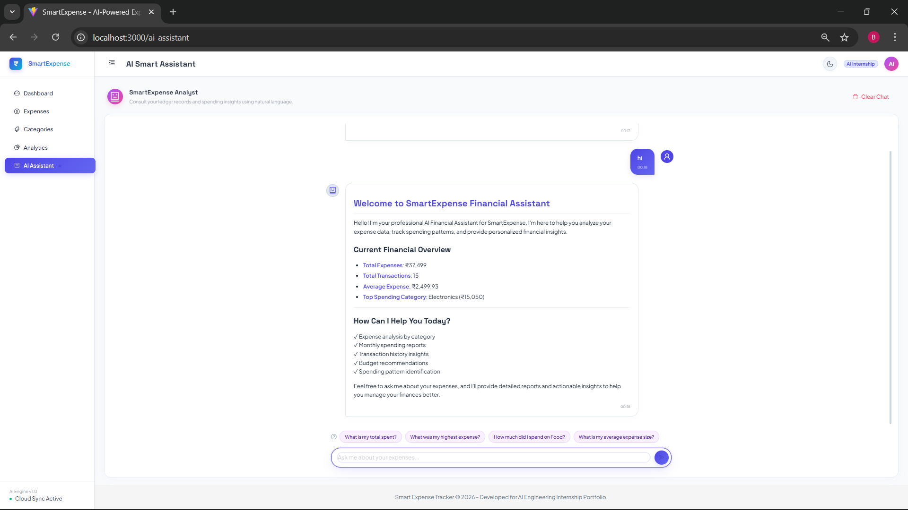
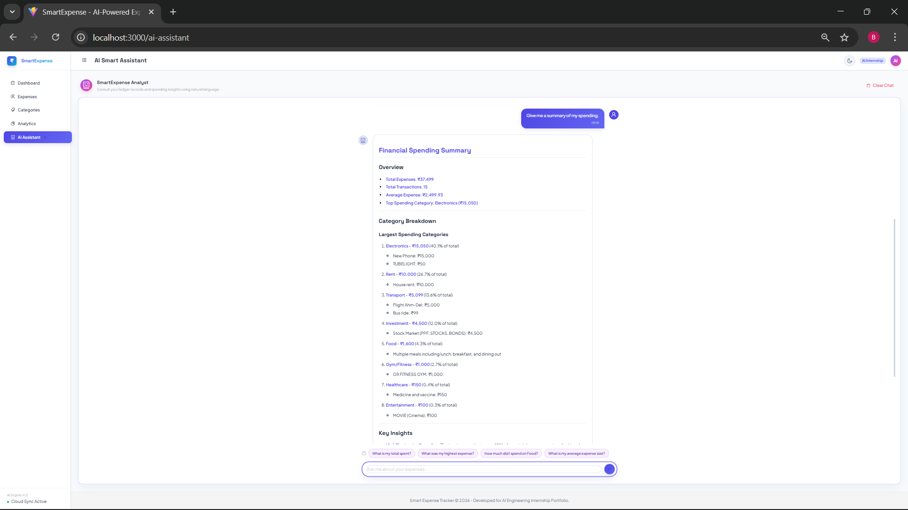

# AI-Powered Expense Tracker with Smart Financial Assistant

A modern full-stack MERN application that combines expense management, financial analytics, and AI-powered financial insights into a single platform.

Built during an AI Engineering Internship (June 2026), SmartExpense helps users track expenses, analyze spending habits, visualize financial trends, and receive personalized recommendations from an AI financial assistant.

---

#  Project Highlights

* Full-Stack MERN Application
* AI-Powered Financial Assistant
* MongoDB Atlas Cloud Database
* OpenRouter LLM Integration
* Expense Analytics Dashboard
* Interactive Pie & Bar Charts
* Category-Based Budget Tracking
* Persistent AI Chat History
* Dark Mode Support
* Responsive SaaS-Style UI
* RESTful API Architecture
* Financial Reports & Recommendations

---

#  Application Preview

| Dashboard                                | Analytics                                |
| ---------------------------------------- | ---------------------------------------- |
|  |  |

| Categories                                | Expense Ledger                                |
| ----------------------------------------- | --------------------------------------------- |
|  |  |

| AI Assistant                                     | AI Insights                                          |
| ------------------------------------------------ | ---------------------------------------------------- |
|  |  |

---

#  System Architecture

```text
┌───────────────────────────────────────────┐
│                 Frontend                  │
│      React + Vite + Ant Design UI         │
└───────────────────┬───────────────────────┘
                    │
                    │ REST API Requests
                    ▼
┌───────────────────────────────────────────┐
│                 Backend                   │
│         Node.js + Express.js APIs         │
└───────────────┬───────────────┬───────────┘
                │               │
                ▼               ▼

       MongoDB Atlas      OpenRouter AI

       Expense Data       Financial Assistant
       Analytics Data     Insights Engine
```

---

#  Application Screenshots

## Dashboard – Financial Overview


Provides a centralized overview of spending metrics, active categories, recent transactions, KPI cards, and quick actions.

---

## Expense Ledger Management


Manage financial transactions with search, filtering, editing, deletion, and category-based organization.

---

## Category Management System


Track category-wise spending and monitor budget distribution percentages.

---

## Spending Analytics Dashboard


Interactive analytics powered by Recharts, including category comparisons, spending trends, KPI cards, and visual insights.

---

## AI Assistant Welcome Interface


ChatGPT-style financial assistant with predefined financial analysis prompts.

---

## AI Assistant Interactive Conversation



Expense-aware conversational AI capable of answering questions using real transaction data.

---

## AI Generated Financial Summary



Automatically generated spending reports and category breakdowns.

---

## AI Insights & Recommendations


AI-powered savings recommendations, financial health analysis, and budgeting suggestions.

---

#  Features

## Expense Management

* Add Expenses
* Edit Expenses
* Delete Expenses
* Search & Filter Expenses
* Category-Based Organization
* Form Validation
* Pagination Support

## Category Management

* 20+ Expense Categories
* Category Statistics
* Category-Wise Tracking
* Budget Distribution Monitoring
* Category Icons & Themes

## Analytics Dashboard

* KPI Statistics Cards
* Spending Overview
* Category Analysis
* Pie Charts
* Bar Charts
* Trend Visualization
* Average Expense Analysis
* Highest & Lowest Expense Tracking

## AI Financial Assistant

* OpenRouter LLM Integration
* Expense-Aware Responses
* Spending Pattern Analysis
* Savings Recommendations
* Financial Health Reports
* Monthly Expense Reports
* Budget Suggestions
* Personalized Financial Insights

## User Experience

* Modern SaaS UI
* Dark Mode Support
* Theme Persistence
* Responsive Design
* Indian Currency Formatting (₹)
* Persistent Chat History
* Interactive Visualizations

---

#  Technology Stack

## Frontend

* React
* Vite
* Ant Design
* Axios
* React Router
* Recharts
* Marked (Markdown Rendering)

## Backend

* Node.js
* Express.js
* MongoDB Atlas
* Mongoose

## AI & Analytics

* OpenRouter API
* Prompt Engineering
* Financial Analytics Engine
* Expense Context Injection

## Development Tools

* Git
* GitHub
* VS Code
* Postman

---

#  Backend APIs

## Expense APIs

```http
POST   /api/expenses
GET    /api/expenses
PUT    /api/expenses/:id
DELETE /api/expenses/:id
```

## Analytics APIs

```http
GET /api/expenses/stats
GET /api/expenses/category-summary
```

## AI APIs

```http
GET  /api/ai/summary
GET  /api/ai/category-analysis
GET  /api/ai/recommendations
GET  /api/ai/monthly-report
POST /api/assistant/chat
```

## Monitoring

```http
GET /api/health
```

---

#  Resume-Worthy Features

### Software Engineering

* Developed a full-stack MERN application.
* Built scalable REST APIs using Express.js.
* Integrated MongoDB Atlas cloud database.
* Applied modular backend architecture.
* Implemented reusable React components.

### Artificial Intelligence

* Integrated OpenRouter LLM APIs.
* Built an expense-aware financial assistant.
* Engineered prompts for contextual financial analysis.
* Generated personalized financial reports and recommendations.

### Data Analytics

* Developed financial KPI dashboards.
* Implemented category-wise analytics pipelines.
* Created interactive data visualizations.
* Generated spending trend reports and insights.

### UI/UX Engineering

* Designed a modern SaaS-inspired interface.
* Implemented Dark Mode and theme persistence.
* Built responsive layouts for multiple screen sizes.
* Created a ChatGPT-style AI assistant experience.

---

#  Project Metrics

### Backend

* 10+ REST APIs
* MongoDB Atlas Integration
* Analytics Engine
* AI Service Layer

### Frontend

* 5 Major Application Pages
* 20+ Reusable Components
* Responsive UI Design
* Theme Persistence System

### AI Features

* Financial Summary Generation
* Category Analysis
* Savings Recommendations
* Monthly Reports
* Conversational Financial Assistant

---

#  Project Structure

```text
expense-tracker-ai
│
├── backend
│   ├── config
│   ├── controllers
│   ├── middleware
│   ├── models
│   ├── routes
│   ├── utils
│   ├── server.js
│   └── package.json
│
├── frontend
│   ├── public
│   ├── src
│   │   ├── components
│   │   ├── pages
│   │   ├── services
│   │   ├── utils
│   │   ├── App.jsx
│   │   └── index.css
│   │
│   └── package.json
│
├── project-screenshots
│   ├── dashboard.png
│   ├── expense-ledger.png
│   ├── categories.png
│   ├── analytics.png
│   ├── ai-assistant-home.png
│   ├── ai-assistant-chat.png
│   ├── ai-assistant-summary.png
│   └── ai-assistant-insights.png
│
├── README.md
└── .gitignore
```

---

#  Installation & Setup

## Clone Repository

```bash
git clone https://github.com/bsb1910/expense-tracker-ai.git
```

## Backend Setup

```bash
cd backend
npm install
npm run dev
```

## Frontend Setup

```bash
cd frontend
npm install
npm run dev
```

---

#  Environment Variables

Create a `.env` file inside the backend directory.

```env
PORT=5000

MONGO_URI=YOUR_MONGODB_ATLAS_CONNECTION_STRING

OPENROUTER_API_KEY=YOUR_OPENROUTER_API_KEY
```

---

#  Future Enhancements

* User Authentication & Authorization
* JWT Security
* PDF Financial Report Generation
* Expense Forecasting using AI
* Budget Planning Assistant
* RAG-Based Financial Knowledge Base
* Multi-User Support
* Cloud Deployment (Render/Vercel)
* Docker Containerization
* CI/CD Pipeline

---

#  Author

**Bhagyesh Bhatt**

B.Tech Computer Science Engineering

AI Engineering Internship Project

June 2026
